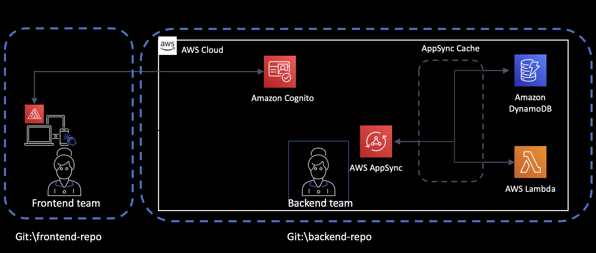
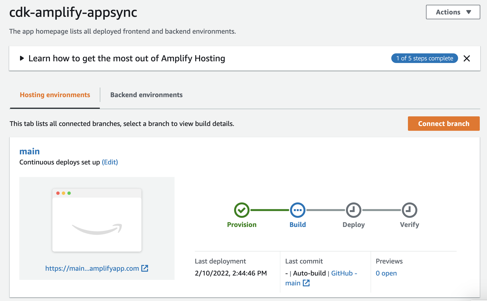
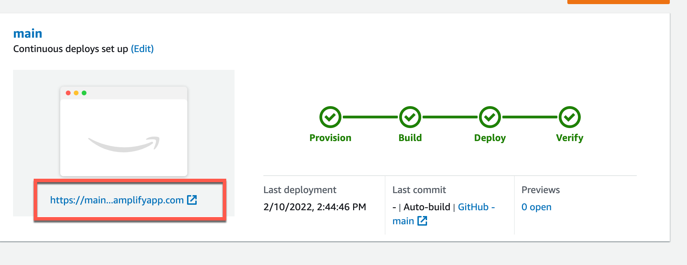

# QuickAid - Full-stack Application with AWS CDK

_Infrastructure as code framework used_: AWS CDK, AWS Amplify
_AWS Services used_: AWS Amplify, AWS Cognito, AWS AppSync, AWS Lambda, AWS DynamoDB

## Introduction to QuickAid

QuickAid is a full-stack application designed to provide quick and efficient aid to users in need. The application combines the power of AWS CDK and AWS Amplify to build a React-based web app with a serverless backend.

QuickAid demonstrates how multiple teams can work together using different frameworks to deploy a web app to the cloud following best practices. This documentation showcases the integration of AWS CDK and AWS Amplify to create a seamless development and deployment experience.

In this documentation, you will find information on:

- How to create an AWS Amplify application using AWS CDK
- How to add authentication with Cognito using AWS CDK to the Amplify web app
- How to add a GraphQL endpoint to AWS Amplify and create it using AWS CDK
- How to deploy and host the web app in the cloud

This project is part of QuickAid's design and architecture, aimed at providing a reliable and scalable solution for delivering aid to users.

## Application Architecture

QuickAid consists of two main components: a client application and a backend application. These components are designed to exist in separate GitHub projects to facilitate collaboration among different teams.

The client application is a React web app that utilizes Amplify libraries to connect to the backend. It will be hosted using the Amplify console for easy deployment and management.

The backend application follows a serverless architecture, consisting of an Amplify app, a Cognito user pool and identity pool, and an AppSync endpoint with two data sources. The AppSync endpoint is generated using the third-party constructor [CDK AppSync Transformer](https://github.com/kcwinner/cdk-appsync-transformer) to simplify the setup process.



## Deploying QuickAid

To deploy QuickAid, we will be using AWS CDK. Make sure you have CDK installed according to the [instructions](https://aws.amazon.com/cdk/). Please note that this project is currently using CDK version 1, and a migrated version will be available soon.

Before deploying, you need to set up the client project in a GitHub repository. Generate a GitHub developer token and store it in the Secret Store (refer to the video tutorial for detailed steps).

Next, copy the `config.example.json` file and create a `config.json` file. In the `config.json` file, provide the correct name of the web app repository, the owner, and the branch.

To deploy the backend to the cloud, follow these steps:

```
$ cd backend
$ npm install ## you only need to do this the first time
$ npm run build
$ cdk deploy
```

After deploying, all the necessary resources will be created, and you can access the Amplify console. You will see that the web app is provisioning.



Once the deployment of the web app is complete, you can obtain the URL and open it in a browser.



### Deleting the Application

To delete the entire application, including the Amplify application and all the backend resources created, run the following command:

```
$ cdk destroy
```

## Resources and Tutorials

For a step-by-step guide on building QuickAid, you can refer to the following video tutorials:

- Part 1: Create the AWS Amplify application using CDK: https://www.youtube.com/watch?v=mSKQlV3lRYw
- Part 2: Add an existing Amazon Cognito user pool and identity pool to an Amplify App using AWS CDK: https://www.youtube.com/watch?v=FydiAbf4iZI
- Part 3: Create a GraphQL endpoint and data sources in the simplest way possible - AppSync with CDK: https://youtu.be/U2T9P2A_fHk

For more in-depth information and additional resources on this topic, check out the blog post: https://blog.marcia.dev/amplify-cdk
